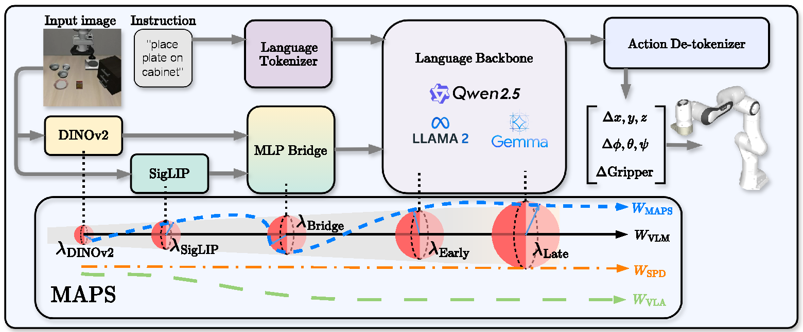
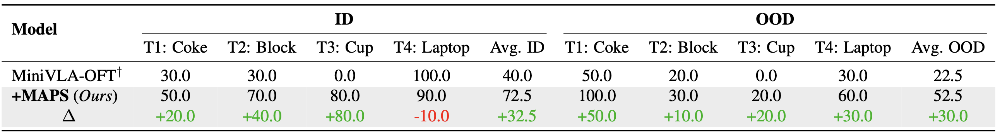
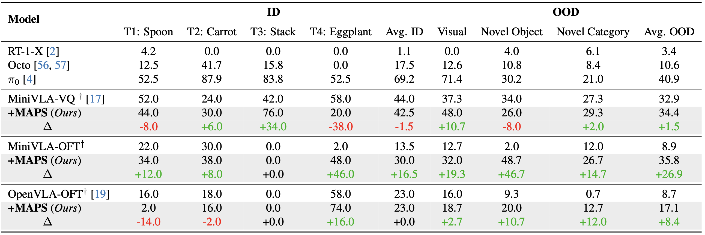
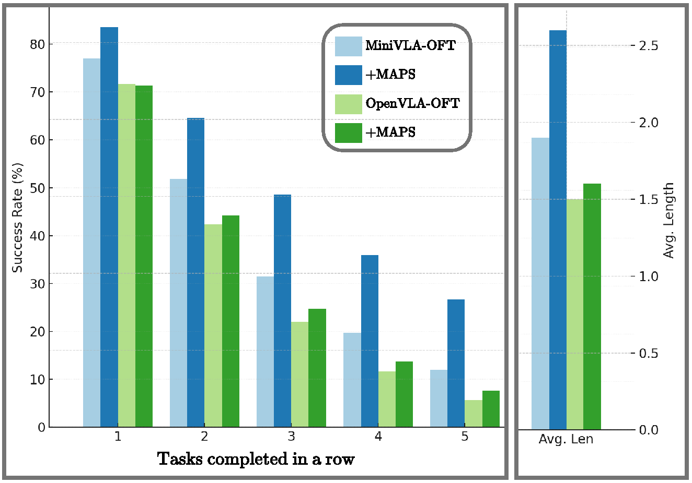
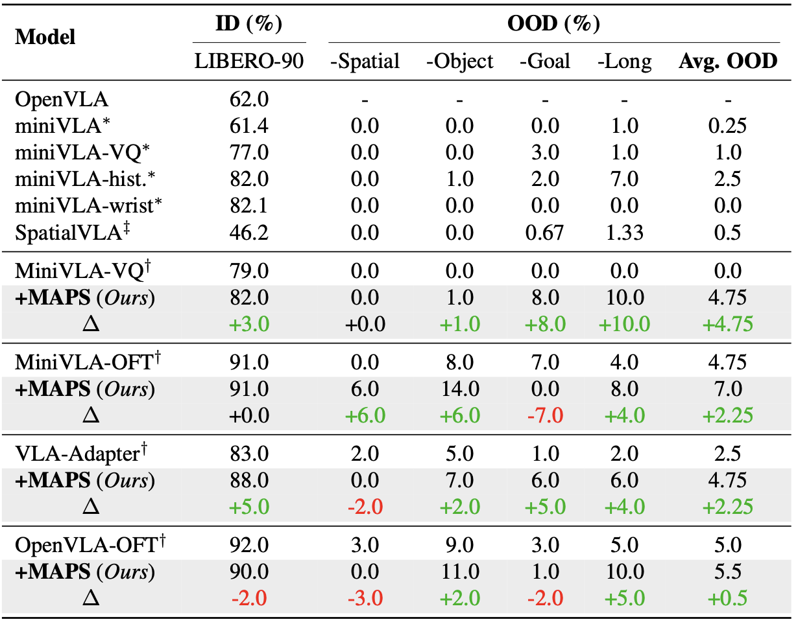

# MAPS: Preserving Vision-Language Representations via Module-Wise Proximity Scheduling for Better VLA Generalization

<div align="center">

**CVPR 2026**

[Chengyue Huang](https://chengyuehuang511.github.io) · [Mellon M. Zhang](https://meilongzhang.github.io) · [Robert Azarcon](https://scholar.google.com/citations?user=v44x75MAAAAJ&hl=en) · [Glen Chou](https://glenchou.github.io) · [Zsolt Kira](https://faculty.cc.gatech.edu/~zk15/)

Georgia Institute of Technology

[](https://openaccess.thecvf.com/content/CVPR2026/html/Huang_MAPS_Preserving_Vision-Language_Representations_via_Module-Wise_Proximity_Scheduling_for_Better_CVPR_2026_paper.html)
[](https://arxiv.org/abs/2511.19878)
[](https://mapsvla.github.io)

</div>

---

## Overview

**MAPS** (Module-Wise Proximity Scheduling) is a parameter-free and data-free robust fine-tuning framework for Vision-Language-Action (VLA) models. Naively fine-tuning a pretrained VLA disrupts the rich representations inherited from the base Vision-Language Model (VLM), hurting generalization. MAPS addresses this by:

1. **Systematically ordering modules** by how much proximity to pretrained weights each component needs.
2. **Linearly scheduling** proximity constraints across modules — visual encoders stay close to their pretrained priors while action-oriented language layers adapt freely.

MAPS integrates into any VLA without additional parameters or data and achieves **up to 30% performance improvements** across LIBERO, CALVIN, SimplerEnv, and real-robot (Franka) benchmarks.

> **This repository contains the first open-source OFT implementation for MiniVLA (0.5B).**

<p align="center">
  
</p>

## Results

#### Real Robot (Franka)

<p align="center">
  
</p>

#### SimplerEnv

<p align="center">
  
</p>

#### CALVIN ABC→D and LIBERO

<p align="center">
  
  
</p>

## Installation

### 1. Clone the repository

```bash
git clone https://github.com/chengyuehuang511/MAPS-VLA.git
cd MAPS-VLA
```

### 2. Create the conda environment

```bash
conda env create -f environment.yml
conda activate maps-vla
```

> **Flash Attention** must be built after the editable install (it compiles against your installed PyTorch):
> ```bash
> pip install flash-attn==2.5.5 --no-build-isolation
> ```

### 3. Install MAPS-VLA in editable mode

```bash
pip install -e .
```

### 4. Install simulation benchmark dependencies

**LIBERO** (from [Koorye/Inspire](https://github.com/Koorye/Inspire)):

> We use the LIBERO version from [Inspire](https://github.com/Koorye/Inspire) rather than the original, as Inspire applies [several fixes that improve evaluation stability and performance](https://github.com/Koorye/Inspire/issues/5).

```bash
pip install "git+https://github.com/Koorye/Inspire.git@66cd41ab7474f6a744212fcc70f5b40968fdd36f#egg=libero&subdirectory=LIBERO"
pip install "git+https://github.com/Koorye/Inspire.git@0e83675f3414e2e3b30b94b62504481bf738451b#egg=vq_bet&subdirectory=vq_bet_official"
```

**CALVIN:**
```bash
git clone https://github.com/mees/calvin.git
cd calvin && git checkout fa03f01f19c65920e18cf37398a9ce859274af76 && git submodule update --init --recursive && cd ..
pip install -e calvin/calvin_env/
pip install -e calvin/calvin_models/
```

**SimplerEnv** (using the Interleave-VLA fork):
```bash
git clone https://github.com/Interleave-VLA/SimplerEnv.git
cd SimplerEnv && git checkout 4762ec802542d69ec8f442926d05a639f3adbc4f && cd ..
pip install -e SimplerEnv/
pip install -e SimplerEnv/ManiSkill2_real2sim/
```

### 5. Configure secrets

```bash
cp .env.example secrets.env
# Edit secrets.env with your paths, API keys, and cluster settings
```

See [`secrets.env`](#secrets) for the full list of required values.

### 6. Exact package versions

The exact environment used in our experiments is captured in `requirements-exact.txt`:

```bash
pip install -r requirements-exact.txt
```

## Data Preparation

Datasets are stored in RLDS format under `data/`. The `data/` directory is gitignored — place your datasets there directly or symlink from elsewhere:

```bash
ln -s /path/to/your/datasets data
```

Expected structure:

```
data/
├── modified_libero_rlds/
│   └── libero_90_no_noops/
├── modified_calvin_rlds/
│   └── calvin_abc_rlds/
└── modified_oxe_rlds/
    └── bridge_orig/
```

Download sources:

| Dataset | Source |
|---------|--------|
| LIBERO-90 (`libero_90_no_noops`) | [hcy511/maps-vla-libero90](https://huggingface.co/datasets/hcy511/maps-vla-libero90) |
| CALVIN ABC→D (`calvin_abc_rlds`) | [hcy511/maps-vla-calvin](https://huggingface.co/datasets/hcy511/maps-vla-calvin) |
| BridgeData V2 (`bridge_orig`) | [hcy511/maps-vla-bridge](https://huggingface.co/datasets/hcy511/maps-vla-bridge) |

## Pretrained Models

Download pretrained model weights and place them under `pretrained_models/`:

| Model | Directory | Source |
|-------|-----------|--------|
| MiniVLA-OFT (0.5B) | `pretrained_models/prism-qwen25-extra-dinosiglip-224px-0_5b/` | [Stanford-ILIAD/prism-qwen25-extra-dinosiglip-224px-0_5b](https://huggingface.co/Stanford-ILIAD/prism-qwen25-extra-dinosiglip-224px-0_5b) |
| OpenVLA-OFT (7B) | `pretrained_models/prism-dinosiglip-224px+7b/` | [TRI-ML/prismatic-vlms](https://huggingface.co/TRI-ML/prismatic-vlms) (`prism-dinosiglip-224px+7b`) |

Config files for each model are already included under `pretrained_models/configs*/`.

## Training with MAPS

MAPS is controlled by three flags present in every training script:

```bash
--weight_decay_scheduler layerwise_decay \
--optimizer SPD \
--weight_decay <lambda_max>
```

| Configuration | Meaning |
|---|---|
| All three flags set | **+MAPS** (module-wise proximity scheduling with SPD optimizer) |
| All three flags removed | **Baseline** (standard AdamW fine-tuning) |
| `--weight_decay_scheduler` removed | SPD optimizer only, no scheduling |

`--weight_decay` sets `lambda_max`, the peak proximity strength on the earliest layers (visual encoder); later layers are linearly relaxed to zero. Per-task values are embedded in each script and reported in the paper.

### Training scripts

All scripts are submitted via:

```bash
bash slurm/submit.sh slurm/train/<script>.sh
```

`submit.sh` sources `secrets.env` and passes all variables to SLURM via `--export=ALL`.

| Script | Model | Benchmark | Nodes | `--weight_decay` |
|---|---|---|---|:---:|
| `train_libero_minivlaoft.sh` | MiniVLA-OFT | LIBERO-90 | 1 | 3.2 |
| `train_libero_openvlaoft.sh` | OpenVLA-OFT | LIBERO-90 | 2 | 1.0 |
| `train_calvin_minivlaoft.sh` | MiniVLA-OFT | CALVIN ABC→D | 1 | 2.5 |
| `train_calvin_openvlaoft.sh` | OpenVLA-OFT | CALVIN ABC→D | 2 | 1.5 |
| `train_bridge_minivlaoft.sh` | MiniVLA-OFT | BridgeData V2 | 1 | 3.0 |
| `train_bridge_openvlaoft.sh` | OpenVLA-OFT | BridgeData V2 | 2 | 0.8 |
| `train_franka_minivlaoft.sh` | MiniVLA-OFT | Franka (real robot) | 1 | 1.5 |

## Evaluation

Set `name=<checkpoint-path>` in the relevant script, then submit:

```bash
bash slurm/submit.sh slurm/eval/<script>.sh
```

| Script | Benchmark | GPUs |
|---|---|:---:|
| `eval_libero.sh` | LIBERO (all suites) | 4 |
| `eval_calvin.sh` | CALVIN ABC→D | 1 |
| `eval_simpler.sh` | SimplerEnv | 1 |

For OpenVLA-OFT checkpoints trained with `--merge_lora_during_training False`, uncomment the `merge_lora` call at the top of each script before evaluating.

## Repository Structure

```
MAPS-VLA/
├── prismatic/                  # Core model library (VLA architecture, datasets, training)
│   ├── models/                 #   Action heads, projectors, backbones
│   ├── training/
│   │   └── optimizers/
│   │       └── spd.py          #   SPD: Proximity-preserving optimizer (MAPS core)
│   └── vla/                    #   Action tokenizer, dataset wrappers
├── scripts/                    # Main train / eval entry points
│   ├── train.py                #   Fine-tuning with MAPS
│   ├── eval_libero.py          #   Parallel LIBERO evaluation
│   ├── eval_calvin.py          #   CALVIN evaluation
│   ├── eval_simpler.py         #   SimplerEnv evaluation
│   └── merge_lora.py           #   Merge LoRA weights into base model
├── experiments/robot/          # Benchmark-specific evaluation wrappers
│   ├── libero/
│   └── simpler/
├── slurm/
│   ├── train/                  #   Training jobs
│   └── eval/                   #   Evaluation jobs
├── pretrained_models/
│   ├── configs/                # MiniVLA-OFT model config (no weights)
│   └── configs-openvla-7b/     # OpenVLA-OFT model config (no weights)
├── data/                       # Datasets (gitignored; symlink or place here)
│   ├── modified_libero_rlds/
│   ├── modified_calvin_rlds/
│   └── modified_oxe_rlds/
├── environment.yml             # Conda environment specification
├── requirements-exact.txt      # Exact pip freeze from our experiments
├── pyproject.toml
├── .env.example                # Secrets template
└── secrets.env                 # Your local secrets (gitignored)
```

## Citation

```bibtex
@inproceedings{huang2026maps,
  title     = {{MAPS}: Preserving Vision-Language Representations via Module-Wise Proximity Scheduling for Better {VLA} Generalization},
  author    = {Huang, Chengyue and Zhang, Mellon M. and Azarcon, Robert and Chou, Glen and Kira, Zsolt},
  booktitle = {Proceedings of the IEEE/CVF Conference on Computer Vision and Pattern Recognition (CVPR)},
  year      = {2026},
}
```

## Acknowledgments

This codebase builds upon [OpenVLA-OFT](https://github.com/moojink/openvla-oft), [openvla-mini](https://github.com/Stanford-ILIAD/openvla-mini), [Inspire](https://github.com/Koorye/Inspire), and [Interleave-VLA/SimplerEnv](https://github.com/Interleave-VLA/SimplerEnv). We thank the authors for their excellent open-source contributions.

## License

MIT License. See [LICENSE](LICENSE) for details.
